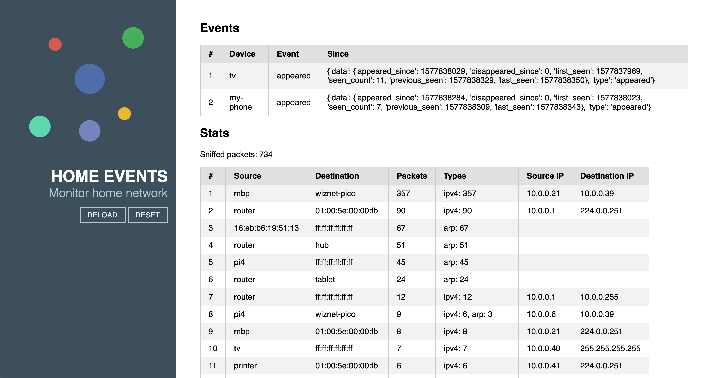

# Home Events
`HomeEvents` monitor communications in the local network, process packets, and detect patterns.

Consider the following scenarios (which could be very common in most households):
1. Parents go to the work in the morning (or start working from home these days)
2. Parents take kids to school
3. Someone turn on the TV in the afternoon

For each of these scenarios, we can define conditions (pre and post) and actions to be executed. 
For example, when everybody left home, turn off the TV and activate monitoring cameras automatically. 

Home Assistant `automation` is a powerful, well-designed feature for these tasks, however, creating the states and triggers is a bit cumbersome.

In this project, we try to decouple the events and leave the action for systems like Home Assistant to handle.

## Quickstart

1. Install CircuitPython on your device: Download the [latest stable release](https://circuitpython.org/board/raspberry_pi_pico/), disconnect PICO, hold the BOOT button down, connect and copy the UF2 file to the PICO and release the BOOT button.
2. Copy libraries to `lib` folder on the device. These are tested and working: https://github.com/home-events/w5100s-circuit-python-libs
3. Create your `config.json` in `src/` folder. See `config-sample.json` for an example.
4. Copy `src/` folder to the root of your device.
5. Type `http://<your-configured-ip-adress>` in your browser.

## Architecture

It consists of three main components:
1. `Sniffer`: collect ethernet packets from the local network
2. `InferenceEngine`: detect patterns in packets and generate events
3. `Notifier`: publish messages to configured channels 

## Limitations and known issues
1. Currently, both MQTT notifier and Web UI do not work together. The problem seems to be the limited number of sockets.

## Milestones
### Phase 1: Basic Implementation 
  * ✅  v0.1: Possibly using circuit/micro python, a basic version of the project which can sniff packets and provide packet stats over a simple telnet server. 
  * ✅  v0.2: Implement basic presence detection. It should be able to detect anybody is home or not 
  * ✅  v0.3: Detect the presence of individuals at home. It should be able to answer if a known person is at home or not. 
### Phase 2: Machine Learning model 
  * v0.4: Report presence and packet activity to the storage system. The storage system could be a simple service on a raspberry pi 3/4 which records data into CSV files. 
  * v0.5: Develop and train presence detection deep learning model 
  * v0.6: Convert the model to TinyML and run it on pico 
  * v0.7: Model Improvements
